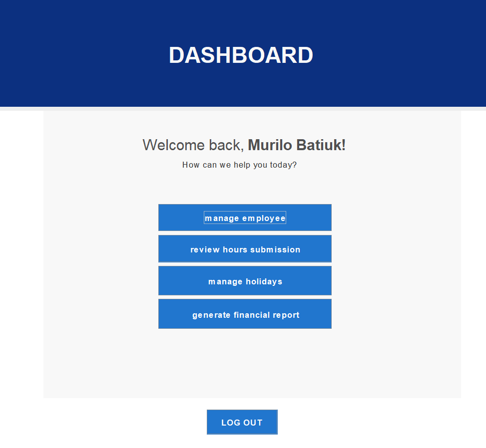

# Payroll Management System

## Overview

The Payroll Management System is a **Java-based GUI application** designed to facilitate employee management, payroll processing, and shift tracking. The application provides both **Admin** and **Employee** sections, ensuring a structured workflow for payroll and attendance tracking. The project is built using **Java**, featuring a **MySQL database hosted on an AWS server**, with **secure credential management** and **PDF generation using iTextPDF**.

---

## Features

### 1. **Login Page**
- Secure login system with authentication.
- Users are categorized into **Admin** and **Employee** roles.
- 

### 2. **Admin Section**
- **Manage Employees:** Add, edit, and remove employee records.
- **Approve/Reject Clock-In & Clock-Out Requests:**
  - Employees submit their shift logs.
  - Admin verifies and approves/rejects the requests.
- **Approve/Reject Holiday Requests:**
  - Employees can submit holiday requests.
  - Admin reviews and approves/rejects requests.
- **Financial Reports:**
  - Calculates total labor costs for the company.
  - Generates financial summaries based on approved shift records.
  - 

### 3. **Employee Section**
- **Clock-In & Clock-Out System:**
  - Employees log their work hours.
  - Requests are sent for admin approval.
- **Holiday Requests:**
  - Employees can request holidays.
  - Requests are reviewed by admins.
- **Salary Statement:**
  - Weekly salary statements generated based on approved work hours.
  - Statements can be downloaded as PDFs.
- **Profile Editing:**
  - Employees can update personal information.
  - 

### 4. **Database Management (MySQL Hosted on AWS)**
- All requests (**Clock-in/out, Holiday Requests, Employee Data**) are stored in a **secure MySQL database**.
- Data is retrieved dynamically for admin approval.
- Uses a **secure file to store database credentials** (for improved security).

### 5. **PDF Generation with iTextPDF**
- Generates employee salary statements in PDF format.
- Financial reports can be exported for documentation.

---

## Technologies Used
- **Java (Swing for GUI)**
- **MySQL (AWS-hosted database)**
- **iTextPDF (PDF generation)**
- **NetBeans (Development Environment)**
- **JDBC (Database Connectivity)**

---

## Installation & Setup
1. **Clone the repository** from GitHub:
   ```sh
   git clone https://github.com/stefanyrjunges/PayrollProject
   ```
2. **Open the project** in **NetBeans**.
3. **Configure the database credentials** in the secure properties file.
4. **Ensure MySQL server** (AWS) is running and accessible.
5. **Run the project**.

---

## Future Improvements
- Implementing **role-based access control (RBAC)** for finer permission control.
- Adding **automated email notifications** for approvals/rejections.
- Enhancing **UI for better user experience**.

---

## Contributors
- **Felipe Paneque** – Developer
- **Stefany Junges** – Developer
- **Murilo Batiuk** – Developer
- **Filip Zielinski** – Developer

For any issues or contributions, please **open an issue or submit a pull request**.

---

## License
This project is licensed under the **MIT License**.

